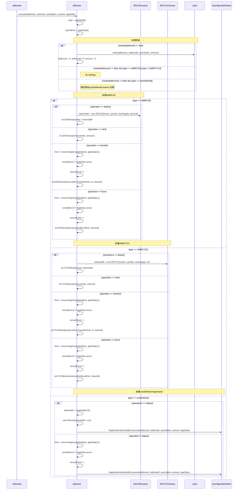

# zkRunes

## 概述

`ZKRunes`是`ZenKeep` 协议的应用合约。 该应用允许用户在BTC上执行Runes操作，使用Eth 作为定序器，解决BTC Runes 中定序器中心化的问题。

`ZKRunes` 根据字节流 `appData` 解码出具体的操作指令，完成：

- 部署新 Token（Deploy）
- 铸造 Token（Mint）
- 转账 Token（Transfer）
- 销毁 Token（Burn）

支持的 Token 类型包括：

- ERC20Capped
- ERC721Capped
- 用户自定义合约地址的Token，`ZKRunes` 要有权限执操作。

---

## Token 类型说明

| 类型名称           | 类型代码 (type) |
|--------------------|------------------|
| ERC20Capped        | 1                |
| ERC721Capped       | 2                |
| 用户自定义地址 Token | 3              |

## 操作类型说明

| 操作名称 | 操作代码 (operation) |
|----------|-----------------------|
| Deploy   | 1                     |
| Mint     | 2                     |
| Transfer | 3                     |
| Burn     | 4                     |

---


## 操作(编码)说明

```
对于 zkBRC20/zkBRC721 
fields:          type   operation  operation_specific_data
len(value):       1           1           (见下面)

对于deploy user specified token
fields:     type    operation  tokenAddress
len(value)   (3)       (1)       20

对于other operation for user specified token
fields:        type      operation   tokenAddress  needVerifySignature  nonce   user-specified data     signature
len(value):     (3)         (!=1)         20             1                8       xxbyte                  64
```


```
deploy a zkBRC20 Capped:
 type  operation    len(name)   name   len(symbol)   symbol    totalSupply   decimal maxInEachMint
  (1)      (1)         1           xx      1            xx        8 bytes        1       1    

deploy a zkBRC721 Capped:
 type    operation  len(name)   name   len(symbol)   symbol    totalSupply  maxInEachMint   len(url)    url
  (2)      (1)       1           xx      1            xx           8 bytes        1              1        xx

deploy a User Specified:
type    operation  tokenAddress
 (3)       (1)       20


mint:
mint a zkBRC20:
type   operation  len(name)   name      to      amount
 (1)       (2)      1          xx       20       1


mint a zkBRC721:
type   operation  len(name)   name      to        amount
 (2)       (2)      1          xx       20         1


transfer a zkBRC20:
type   operation  len(name)   name  nonce    to      amount  signature
 (1)       (3)      1          xx     8      20        16     64


transfer a zkBRC721:
type   operation    len(name)  name   nonce   to      tokenId    signature
 (2)    (3)          1          xx     8      20        16         64 


burn a zkBRC20:
type   operation  len(name)   name  nonce     amount  signature
 (1)       (4)      1          xx     8        16     64


burn a zkBRC721:
type   operation  len(name)   name  nonce     tokenId  signature
 (2)       (4)      1          xx     8        16       64


User Specified opeations:
type      operation   tokenAddress    nonce   user-specified data     signature
(3)         (!=1)         20            8       xxbyte                  64

```

## 操作流程


